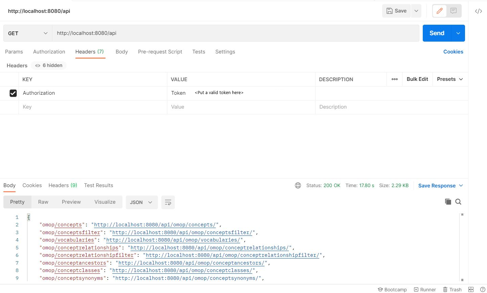

# API for OMOP and Co-Connect DBs

The mapping-pipeline API allows programmtic interaction with co-connect DB and OMOP CDM DB contents. The API is developed using the Django REST framework. A token based authentication is applied to access API endpoints. API endpoints can be tested through a tool called Postman. A postman is a tool to develop and test APIs. 

## API Root
An API root can be accessed using: **http://localhost:8080/api** and this endpoint lists all the available endpoints in an API (see Figure 1). Figure 1 also demonstrates that for testing API endpoints, a token is required, that can be requested to the system administrator.   

**Figure 1** *A sample API endpoint testing through postman*

## OMOP DB 
We have implemented enpoints for following 8 tables of OMOP CDM DB. The API endpoints for these tables are read only. 

1. concept table: 
    * **http://localhost:8080/api/omop/concepts/** Returns all records in a concept table
    * **http://localhost:8080/api/omop/concepts/1/** Returns concept details from the concept table for concept_id=1 
    * **http://localhost:8080/api/omop/conceptsfilter/?concept_code=R51&vocabulary_id=ICD10CM** This will return a record that has "concept_code=R51" and "vocabulary_id=ICD10CM"
2. vocabulary table: 
    * **http://localhost:8080/api/omop/vocabularies/** Returns all records of a vocabulary table
    * **http://localhost:8080/api/omop/vocabularies/Cost/**	Returns a record from a vocabulary table with vocabulary id=Cost

3. concept_relationship table: 
    * **http://localhost:8080/api/omop/conceptrelationships** Returns all records of a concept relationship table
    * **http://localhost:8080/api/omop/conceptrelationships/?concept_id_1=5&concept_id_2=58&relationship_id=Concept%20replaced%20by** To get a unique row of concept_relationship table we need to give three query terms that consists of concept_id_1, concept_id_2 and relationship_id. However to get all records with a specific query terms for concept_id_1 or with concept_id_2 or relationship_id or any combination of these can be applied.
    * The above enpoint was a special case as there was no single primary key assigned to the table and therefore, we provided a filter capability to extract records with a simple enpoint with no filter word written at the end of an endpoint. In all other api endpoints when a filter is applied, a word filter is placed at the end of the endpoints. To make API consistant we also also provide alternate endpoints that ends with the filter and the above two samples can also be written something like this: http://localhost:8080/api/omop/conceptrelationshipfilter and http://localhost:8080/api/omop/conceptrelationshipfilter/?concept_id_1=5&concept_id_2=58&relationship_id=Concept%20replaced%20by.

4. concept_ancestor table: 
    * **http://localhost:8080/api/omop/conceptancestors/** Returns all records of a concept_ancestor table
    * **http://localhost:8080/api/omop/conceptancestors/262/** Returns a record from the concept_ancestor table with concept a concept ancestor id=262
	
5. concept_class table: 
    * **http://localhost:8080/api/omop/conceptclasses**	Returns all records of a concept_class table
    * **http://localhost:8080/api/omop/conceptclasses/10th%20level/** Returns a record from concept_class table with a concept id='10th level'

6. concept_synonym table: 
    * **http://localhost:8080/api/omop/conceptsynonyms/** Returns all records of a concept_synonym table
    * **http://localhost:8080/api/omop/conceptsynonyms/2/** Returns a record from concept_synonym table with a concept_id=2
	
7. Domain Table: 
    * **http://localhost:8080/api/omop/domains** Returns all records of a domain table
    * **http://localhost:8080/api/omop/domains/Condition/**	Returns a record of a domain table with a domain_id='Condition'

8. drug_strength Table: 
    * **http://localhost:8080/api/omop/drugstrengths/**	Returns all records of a drug_strength table
    * **http://localhost:8080/api/omop/drugstrengths/?drug_concept_id=32763&ingredient_concept_id=32763** To get a unique row of drug_strength table we need to give two query terms that consists of drug_concept_id and ingredient_concept_id. However a query term can be defined to get all records either by giving drug_concept_id or ingredient_concept_id.)
	
## Co-Connect DB

We have implemented enpoints for following 16 tables of co-connect DB. 

1. mapping_scanreport table
    * **http://localhost:8080/api/scanreports/** All scan reports in a mapping_scanreport table
    * **http://localhost:8080/api/scanreports/31/** A record in a mapping_scanreport table with id=31
	
2. mapping_scanreporttable table
    * **http://localhost:8080/api/scanreporttables/** All scan report tables in a mapping_scanreporttables table
    * **http://localhost:8080/api/scanreporttables/1** A record in a mapping_scanreportables table with id=1
	* **http://localhost:8080/api/scanreporttablesfilter/?scan_report=1&name=Freezer.csv** This will return a record that has a "scan_report=1" and "name=Freezer.csv"
	
3. mapping_scanreportfield table
    * **http://localhost:8080/api/scanreportfields/** All scan report fields in a mapping_scanreportfield table
    * **http://localhost:8080/api/scanreportfields/4638/** A record in a mapping_scanreportfields with id=4638 
    * **http://localhost:8080/api/scanreportfieldsfilter/?scan_report_table=419&name=altered_conscious_state** This will return a record from a mapping_scanreportfield table with "scan_report_table=419" and "name=altered_conscious_state"
    *  **http://localhost:8080/api/scanreportfieldsfilter/?scan_report_table=419** This will return all records from a mapping_scanreportfield table with "scan_report_table=419"

4. mapping_scanreportvalue table
    * **http://localhost:8080/api/scanreportvalues/** All scan report values in a mapping_scanreportvalues
    * **http://localhost:8080/api/scanreportvalues/2/** A record in a mapping_scanreportvalues with id=2
    * **http://localhost:8080/api/scanreportvaluesfilter/?scan_report_field=222&value=Surgery** This will return a record from a mapping_scanreportvalue table with "scan_report_field=222" and "value=surgery"
    * **http://localhost:8080/api/scanreportvaluesfilter/?scan_report_field=222** This will return all records from a mapping_scanreportvalue table with "scan_report_field=222"

5. mapping_scanreportconcept table	
    * **http://localhost:8080/api/scanreportconcepts/** All scan report concepts in a mapping_scanreportconcepts
    * **http://localhost:8080/api/scanreportconcepts/2/** A record in a mapping_scanreportconcepts with id=2
	
6. mapping table	
    * **http://localhost:8080/api/mappings/** All records in a mapping table
    * **http://localhost:8080/api/mappings/1/** A record in a mapping table with id=1

7. mapping_classificationsystem table	
    * **http://localhost:8080/api/classificationsystems/** All records in a mapping_classificationsystem table
    * **http://localhost:8080/api/classificationsystems/2/** A record in a mapping_classificationsystem table with id=2

8. mapping_datadictionary table	
    * **http://localhost:8080/api/datadictionaries** All records in a mapping_datadictionary table
    * **http://localhost:8080/api/datadictionaries/2/** A record in a mapping_datadictionary table with id=2

9. mapping_document table	
    * **http://localhost:8080/api/documents/** All records in a mapping_document table
    * **http://localhost:8080/api/documents/2** A record in a mapping_document table with id=2

10. mapping_documentfile table	
    * **http://localhost:8080/api/documentfiles/** All records in a mapping_documentfiles table
    * **http://localhost:8080/api/documentfiles/2** A record in a mapping_documentfiles table with id=2

11. datapartner table	
     * **http://localhost:8080/api/datapartners/** All records in a datapartner table
     * **http://localhost:8080/api/datapartners/2/** A record in a datapartner table with id=2
     * **http://localhost:8080/api/datapartnersfilter/?name=University%20of%20Liverpool** This will return a record that has "name=University of Liverpool"

12. mapping_omoptable table	
     * **http://localhost:8080/api/omoptables/** All records in a mapping_omoptable table
     * **http://localhost:8080/api/omoptables/1673/** A record in a mapping_omoptable table with id=1673

13. mapping_omopfield table	
     * **http://localhost:8080/api/omopfields/** All records in a mapping_omopfield table
     * **http://localhost:8080/api/omopfields/450/** A record in a mapping_omopfield table with id=2

14. mapping_structuralmappingrule table	
     * **http://localhost:8080/api/structuralmappingrules/** All records in a mapping_structuralmappingrule
     * **http://localhost:8080/api/structuralmappingrules/8194** A record in a mapping_structuralmappingrule table with id=8194	
	
15. source table	
     * **http://localhost:8080/api/sources/** All records in a source table
     * **http://localhost:8080/api/sources/1/** A record in a source table with id=1   (Currently there is no record in the azure dev DB version)
		
16. documenttype table	
     * **http://localhost:8080/api/documenttypes/** All records in a documenttype table
     * **http://localhost:8080/api/documenttypes/2/** A record in a documenttype table with id=2
	
